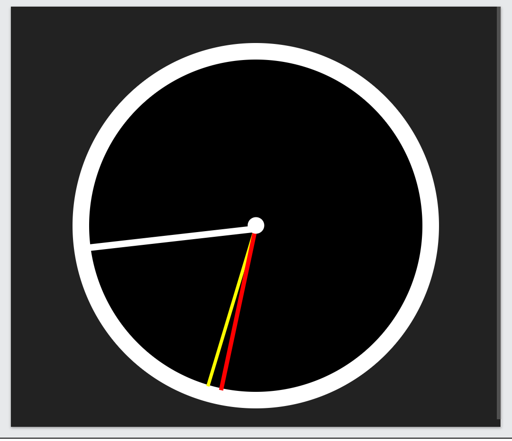
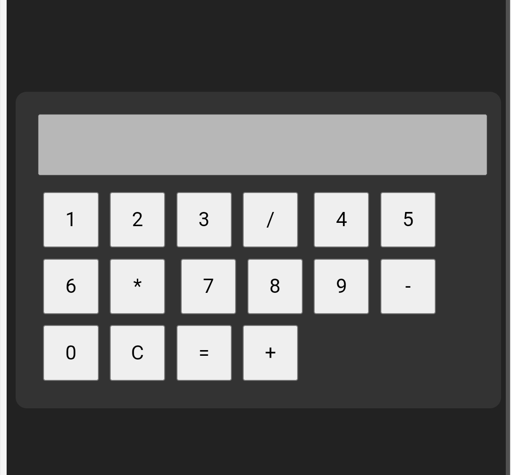

£<h1 align="center">🚀 Welcome to My Portfolio 🚀</h1>

<!-- Typing animation -->

  

<!-- Bubble animation -->

  

---

## 📂 Projects  

### ⏰ Clock Project  
⏱️ A digital clock that updates in real time.  

  

File: `clock.html`  

---

### 🧮 Calculator Project  
🧾 A simple calculator that performs basic operations (**addition, subtraction, multiplication, division**).  

  

File: `calculator.2.html`  

---

## 📊 GitHub Stats  
  

---

## 🔥 Streaks  
  

---

## 💻 Top Languages  
  

---

## 📈 Contribution Graph  
  

---

⭐ From [rakeshh213](https://github.com/rakeshh213)
